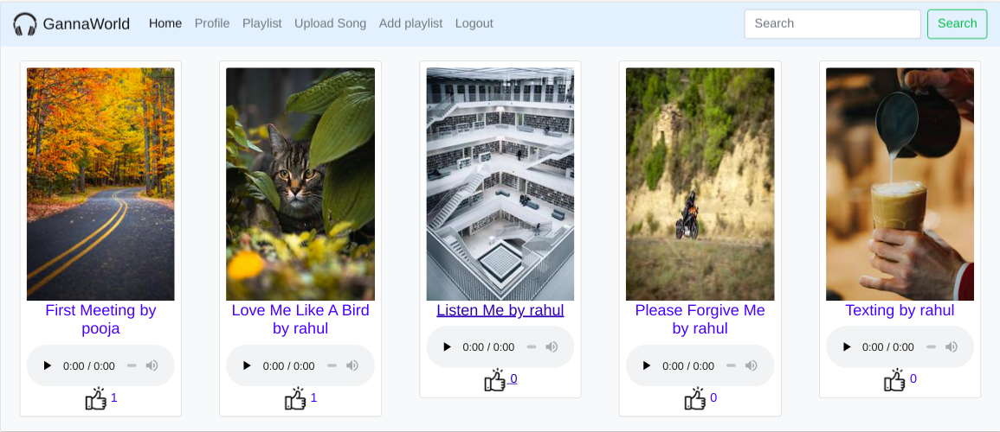
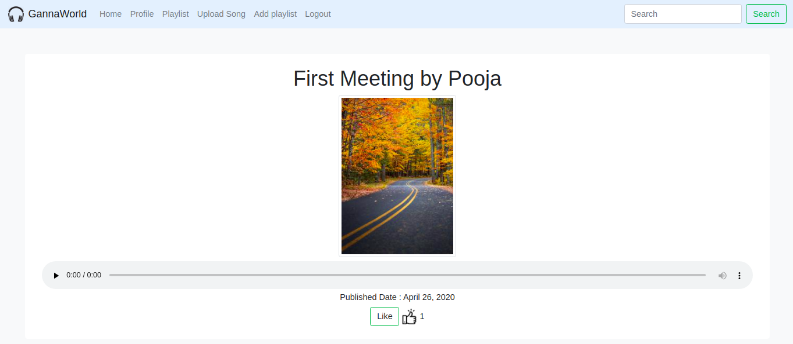
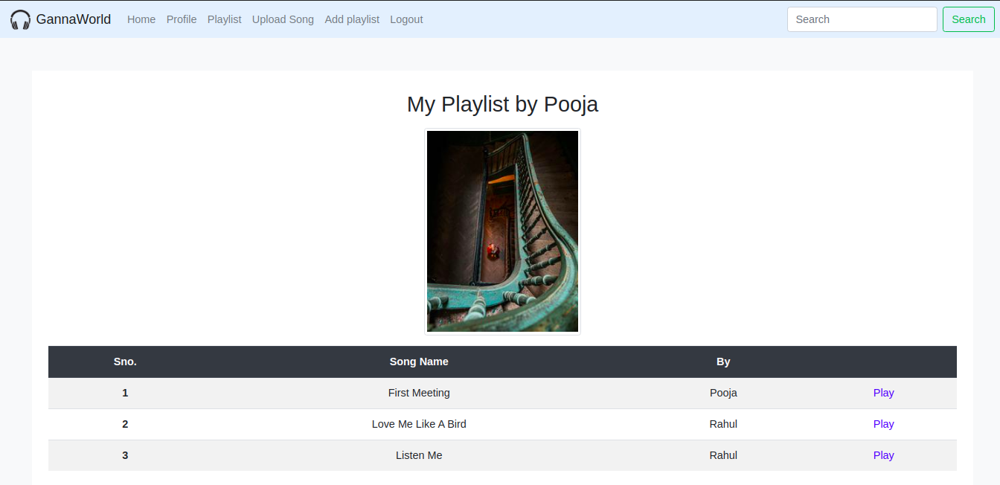

# GannaWorld

### GannaWorld is an online music library where user can upload their music, and also create a playlist of their favourite songs.

### Technologies

* Python 3.7.
* Django >3.
* crispy_forms for form styling.
* BootStrap, jquery.
* Ajax for like and dislike operation.

### Installation
* make virtual environment and activate virctual environment 
  ```bash
  $ python3 -m venv GannaWorld_venv
  $ source GannaWorld_venv/bin/activate
  ```
* clone respositry
  ```bash
  $(GannaWorld_venv) git clone https://github.com/rahulsa123/GannaWorld.git
  $(GannaWorld_venv) cd GannaWorld
  ```
* Install dependencies and run server
  ```bash
  $(GannaWorld_venv) pip3 install -r requirements.txt
  $(GannaWorld_venv) ./manage.py makemigrations
  $(GannaWorld_venv) ./manage.py migrate
  $(GannaWorld_venv) ./manage.py createsuperuser # for admin page
  $(GannaWorld_venv) ./manage.py runserver
  ```
 Note: If the admin creates a user from the administration site, make sure that the profile of that user is also created from the administration site.
 
 ## Screenshot
 ### homepage
 
 
 
 ### Song
 
 
 ### PlayList
 
